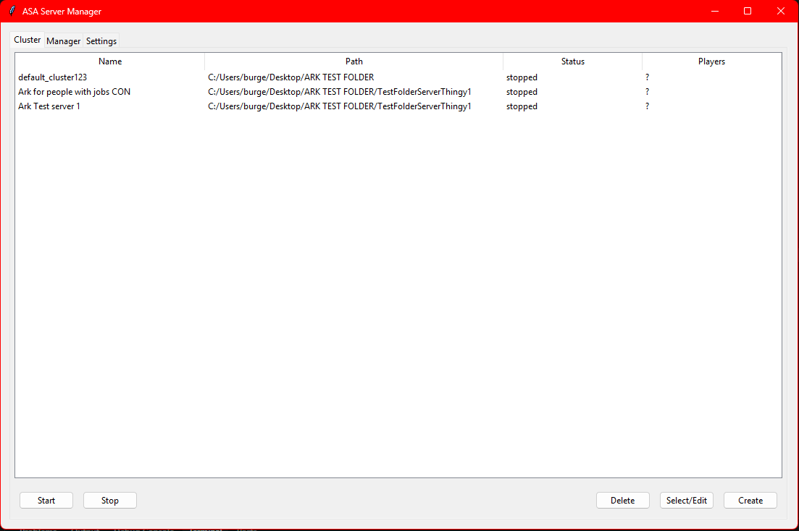
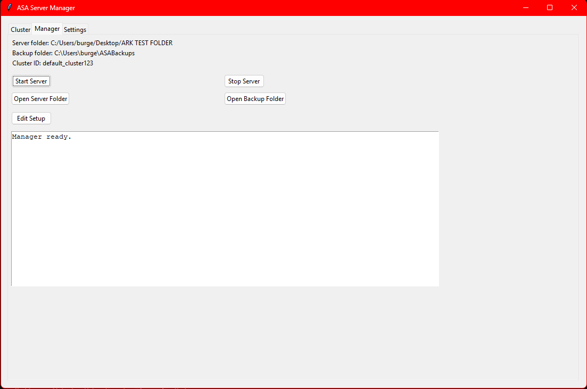
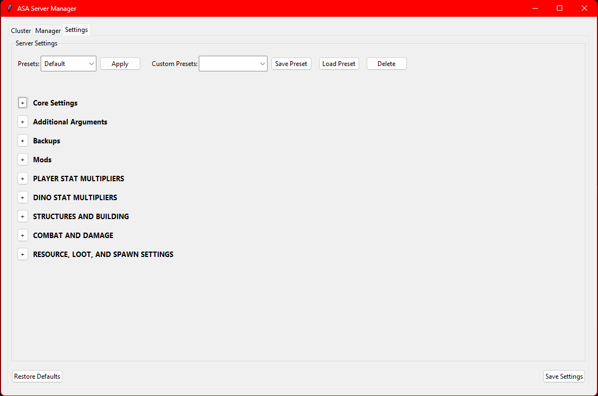
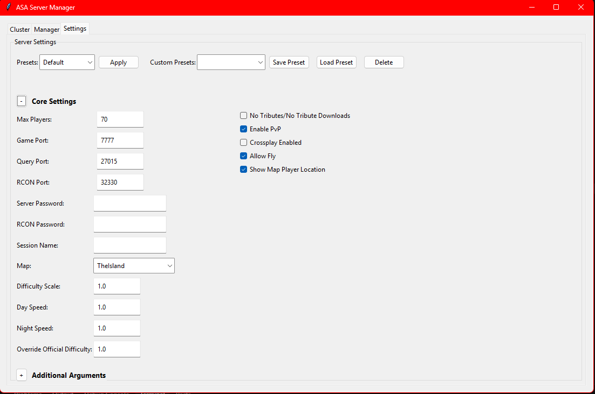

ASA Dedicated Server Launcher (Windows)

<p align="center">
  
  
  
  
</p>

ASAM (Ark Server Ascended Manager) is a dedicated cluster management tool for Ark: Survival Ascended. It lets you view servers, edit settings, handle backups, manage mods, schedule restarts, and more — all from one place.
Built to fix the gaps and instability found in other managers, ASAM is a single executable that automates setup and keeps everything running smoothly.

Requirements
- Windows 10 or later
- Python 3.8+ (Tkinter required — usually included with the standard Windows installer)

How to run
1. Open PowerShell in this folder:

```powershell
cd "./ASAM"
python launcher.py
```


* Credit *
<a target="_blank" href="https://icons8.com/icon/rLJtBvI9A7KS/ark-survival-evolved">Ark Survival Evolved</a> icon by <a target="_blank" href="https://icons8.com">Icons8</a>